## Development Guide

### Browser Only

1. Clone repository

2. Install dependencies

```bash
pnpm install
```

3. Start development server:

```bash
pnpm run dev
```

### With Backend

1. Clone repository

2. Install dependencies

```bash
pnpm install
```

3. Configure environment

```bash
cp .env.example .env
# Edit .env with your Telegram API keys, DATABASE_TYPE / DATABASE_URL, PROXY_URL, etc.
```

4. Start database container:

```bash
# Docker is only used for database container in local development.
docker compose up -d pgvector
```

5. Start services:

```bash
# Start backend
pnpm run server:dev

# Start frontend
pnpm run web:dev
```

## Architecture

```mermaid
graph TB
    subgraph "🖥️ Frontend Layer"
        Frontend["Web Frontend<br/>(Vue 3 + Pinia)"]
        Electron["Electron Desktop"]

        subgraph "Client Event Handlers"
            ClientAuth["Auth Handler"]
            ClientMessage["Message Handler"]
            ClientStorage["Storage Handler"]
            ClientEntity["Entity Handler"]
            ClientServer["Server Handler"]
        end
    end

    subgraph "🌐 Communication Layer"
        WS["WebSocket Event Bridge<br/>Real-time Bidirectional<br/>• Event Registration<br/>• Event Forwarding<br/>• Session Management"]
    end

    subgraph "🚀 Backend Service Layer"
        Server["Backend Server<br/>(REST API)"]

        subgraph "Session Management"
            SessionMgr["Session Manager<br/>• Client State<br/>• CoreContext Instance<br/>• Event Listeners"]
        end
    end

    subgraph "🎯 Core Event System"
        Context["CoreContext<br/>🔥 Central Event Bus<br/>(EventEmitter3)<br/>• ToCoreEvent<br/>• FromCoreEvent<br/>• Event Wrappers<br/>• Error Handling"]

        subgraph "Core Event Handlers"
            AuthHandler["🔐 Auth Handler"]
            MessageHandler["📝 Message Handler"]
            DialogHandler["💬 Dialog Handler"]
            StorageHandler["📦 Storage Handler"]
            ConfigHandler["⚙️ Config Handler"]
            EntityHandler["👤 Entity Handler"]
            GramEventsHandler["📡 Gram Events Handler"]
            MessageResolverHandler["🔄 Message Resolver Handler"]
        end
    end

    subgraph "🔧 Business Service Layer"
        subgraph "Services"
            AuthService["Authentication<br/>Service"]
            MessageService["Message<br/>Service"]
            DialogService["Dialog<br/>Service"]
            StorageService["Storage<br/>Service"]
            ConfigService["Config<br/>Service"]
            EntityService["Entity<br/>Service"]
            ConnectionService["Connection<br/>Service"]
            TakeoutService["Takeout<br/>Service"]
        end

        subgraph "Message Processing Pipeline"
            MsgResolverService["Message Resolver<br/>Service"]

            subgraph "Message Resolvers"
                EmbeddingResolver["🤖 Embedding<br/>Resolver<br/>(OpenAI)"]
                JiebaResolver["📚 Jieba<br/>Resolver<br/>(Chinese Segmentation)"]
                LinkResolver["🔗 Link<br/>Resolver"]
                MediaResolver["📸 Media<br/>Resolver"]
                UserResolver["👤 User<br/>Resolver"]
            end
        end
    end

    subgraph "🗄️ Data Layer"
        DB["PostgreSQL<br/>+ pgvector"]
        Drizzle["Drizzle ORM"]
    end

    subgraph "📡 External APIs"
        TelegramAPI["Telegram API<br/>(gram.js)"]
        OpenAI["OpenAI API<br/>Vector Embeddings"]
    end

    %% WebSocket Event Flow
    Frontend -.->|"WsEventToServer<br/>• auth:login<br/>• message:query<br/>• dialog:fetch"| WS
    WS -.->|"WsEventToClient<br/>• message:data<br/>• auth:status<br/>• storage:progress"| Frontend

    Electron -.->|"WebSocket Events"| WS
    WS -.->|"Real-time Updates"| Electron

    %% Server Layer
    WS <--> Server
    Server --> SessionMgr
    SessionMgr --> Context

    %% Core Event System (Key Architecture Highlight)
    Context <==> AuthHandler
    Context <==> MessageHandler
    Context <==> DialogHandler
    Context <==> StorageHandler
    Context <==> ConfigHandler
    Context <==> EntityHandler
    Context <==> GramEventsHandler
    Context <==> MessageResolverHandler

    %% Event Handlers to Services
    AuthHandler --> AuthService
    MessageHandler --> MessageService
    DialogHandler --> DialogService
    StorageHandler --> StorageService
    ConfigHandler --> ConfigService
    EntityHandler --> EntityService
    GramEventsHandler --> ConnectionService
    MessageResolverHandler --> MsgResolverService

    %% Message Processing Pipeline
    MessageService --> MsgResolverService
    MsgResolverService --> EmbeddingResolver
    MsgResolverService --> JiebaResolver
    MsgResolverService --> LinkResolver
    MsgResolverService --> MediaResolver
    MsgResolverService --> UserResolver

    %% Data Layer
    StorageService --> Drizzle
    Drizzle --> DB

    %% External APIs
    AuthService --> TelegramAPI
    MessageService --> TelegramAPI
    DialogService --> TelegramAPI
    EntityService --> TelegramAPI
    EmbeddingResolver --> OpenAI

    %% Client Event System
    Frontend --> ClientAuth
    Frontend --> ClientMessage
    Frontend --> ClientStorage
    Frontend --> ClientEntity
    Frontend --> ClientServer

    %% Styling
    classDef frontend fill:#4CAF50,stroke:#2E7D32,color:#fff,stroke-width:2px
    classDef websocket fill:#FF9800,stroke:#E65100,color:#fff,stroke-width:3px
    classDef server fill:#2196F3,stroke:#1565C0,color:#fff,stroke-width:2px
    classDef context fill:#E91E63,stroke:#AD1457,color:#fff,stroke-width:4px
    classDef handler fill:#9C27B0,stroke:#6A1B9A,color:#fff,stroke-width:2px
    classDef service fill:#607D8B,stroke:#37474F,color:#fff,stroke-width:2px
    classDef resolver fill:#795548,stroke:#3E2723,color:#fff,stroke-width:2px
    classDef data fill:#3F51B5,stroke:#1A237E,color:#fff,stroke-width:2px
    classDef external fill:#F44336,stroke:#C62828,color:#fff,stroke-width:2px

    class Frontend,Electron,ClientAuth,ClientMessage,ClientStorage,ClientEntity,ClientServer frontend
    class WS websocket
    class Server,SessionMgr server
    class Context context
    class AuthHandler,MessageHandler,DialogHandler,StorageHandler,ConfigHandler,EntityHandler,GramEventsHandler,MessageResolverHandler handler
    class AuthService,MessageService,DialogService,StorageService,ConfigService,EntityService,ConnectionService,TakeoutService,MsgResolverService service
    class EmbeddingResolver,JiebaResolver,LinkResolver,MediaResolver,UserResolver resolver
    class DB,Drizzle data
    class TelegramAPI,OpenAI external
```



### Event-Driven Architecture Overview

#### 📦 Package Responsibilities

- **`packages/core`**: The heart of the application containing:
  - **CoreContext**: Central event bus using EventEmitter3
  - **Event Handlers**: Listen to and process events from the event bus
  - **Services**: Business logic implementations (Auth, Message, Storage, etc.)
  - **Message Resolvers**: Process messages through various resolvers (Embedding, Jieba, Link, Media, User)
  - **Database Models & Schemas**: Drizzle ORM models and PostgreSQL schemas

- **`packages/client`**: Client-side integration layer containing:
  - **Adapters**: WebSocket and Core Bridge adapters for different runtime environments
  - **Event Handlers**: Client-side event handlers that communicate with the backend
  - **Stores**: Pinia stores for state management (Auth, Chat, Message, Settings, Sync)
  - **Composables**: Reusable Vue composition functions

- **`packages/common`**: Shared utilities:
  - **Logger**: Centralized logging using @guiiai/logg
  - **Utilities**: Common helper functions

- **`apps/server`**: WebSocket server:
  - Manages WebSocket connections
  - Routes events between clients and CoreContext instances
  - Handles session management

- **`apps/web`**: Vue 3 frontend application:
  - User interface built with Vue 3, Pinia, and Vue Router
  - Integrates with packages/client for backend communication
  - Supports both browser-only mode (with PGlite) and server mode (with PostgreSQL)

#### 🎯 Core Event System

- **CoreContext - Central Event Bus**: The heart of the system using EventEmitter3 for managing all events
  - **ToCoreEvent**: Events sent to the core system (auth:login, message:query, etc.)
  - **FromCoreEvent**: Events emitted from core system (message:data, auth:status, etc.)
  - **Event Wrapping**: Automatic error handling and logging for all events
  - **Session Management**: Each client session gets its own CoreContext instance

#### 🌐 Communication Layer

- **WebSocket Server**: Real-time bidirectional communication
  - **Event Registration**: Clients register for specific events they want to receive
  - **Event Forwarding**: Seamlessly forwards events between frontend and CoreContext
  - **Session Persistence**: Maintains client state and event listeners across connections

- **Client Adapters**: Support multiple runtime environments
  - **WebSocket Adapter**: For server mode with real-time backend connection
  - **Core Bridge Adapter**: For browser-only mode with in-browser database (PGlite)

#### 🔄 Message Processing Pipeline

Stream-based message processing through multiple resolvers:
- **Embedding Resolver**: Generates vector embeddings using OpenAI/Ollama for semantic search
- **Jieba Resolver**: Chinese word segmentation for better search capabilities
- **Link Resolver**: Extracts and processes links from messages
- **Media Resolver**: Handles media attachments (photos, videos, documents)
- **User Resolver**: Processes user mentions and references

#### 📡 Event Flow

1. **Frontend** → User interaction triggers an action in Vue component
2. **Client Store** → Store dispatches an event via WebSocket Adapter
3. **WebSocket** → Event is sent to backend server
4. **CoreContext** → Event bus routes to appropriate event handler
5. **Event Handler** → Processes event and calls corresponding service
6. **Service** → Executes business logic (may call Telegram API or database)
7. **Service** → Emits result event back through CoreContext
8. **WebSocket** → Forwards event to frontend client
9. **Client Event Handler** → Updates client store with new data
10. **Frontend** → Vue components reactively update UI

#### 🗄️ Database Support

The application supports two database modes:
- **PostgreSQL + pgvector**: For production deployments with full vector search capabilities
- **PGlite**: In-browser PostgreSQL for browser-only mode (experimental)
