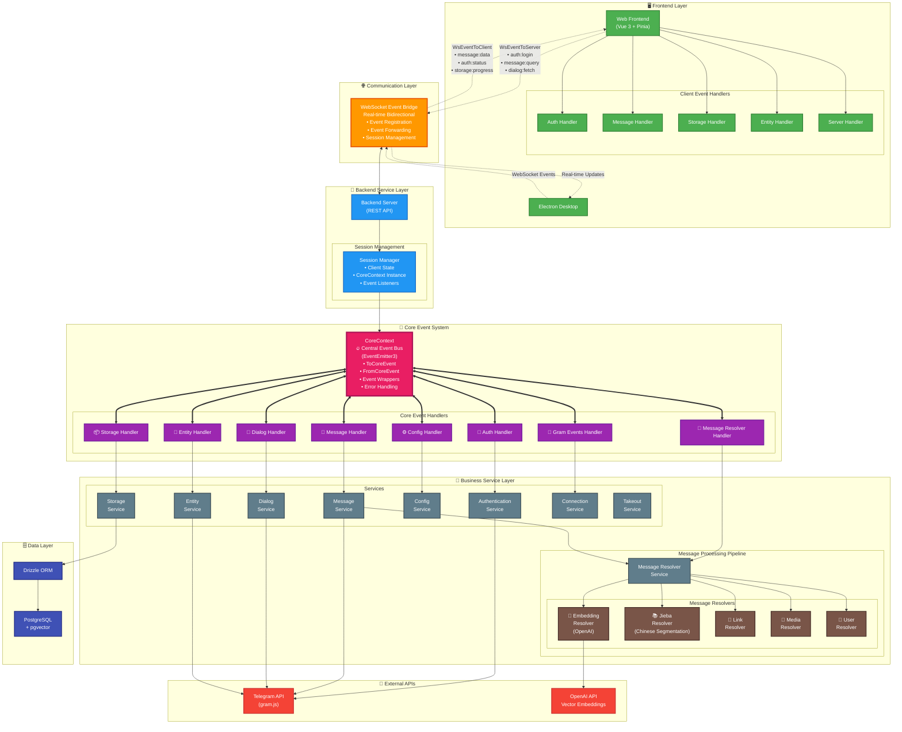

<h1 align="center">Telegram Search</h1>

<p align="center">
  <a href="https://trendshift.io/repositories/13868" target="_blank"></a>
</p>

<p align="center">
   [<a href="https://search.lingogram.app">Try it Now</a>] [<a href="https://discord.gg/NzYsmJSgCT">Join Discord Server</a>] [<a href="./docs/README_CN.md">简体中文</a>] [<a href="./docs/README_JA.md">日本語</a>]
</p>

<p align="center">
  <a href="https://app.netlify.com/projects/tgsearch/deploys"></a>
  <a href="https://deepwiki.com/GramSearch/telegram-search"></a>
  <a href="https://github.com/GramSearch/telegram-search/blob/main/LICENSE"></a>
    <a href="https://discord.gg/NzYsmJSgCT"></a>
  <a href="https://t.me/+Gs3SH2qAPeFhYmU9"></a>
</p>

> [!WARNING]
> We have not issued any virtual currency, please do not be deceived.

> [!CAUTION]
> This software can only export your own chat records for search, please do not use it for illegal purposes.

A powerful Telegram chat history search tool that supports vector search and semantic matching. Based on OpenAI's semantic vector technology, it makes your Telegram message retrieval smarter and more precise.

## 💖 Sponsors


## 🌐 Try it Now

We provide an online version where you can experience all features of Telegram Search without self-deployment.

> [!NOTE]
> We promise not to collect any user privacy data, you can use it with confidence

Visit: https://search.lingogram.app

## 🚀 Quick Start

### Runtime environment variables

> [!TIP]
> All environment variables are optional. The application will work with default settings, but you can customize behavior by setting these variables.

### Start with Docker Image

> [!IMPORTANT]
> The simplest way to get started is to run the Docker image without any configuration. All features will work with sensible defaults.

1. Run docker image default without any environment variables:

```bash
docker run -d --name telegram-search \
  -p 3333:3333 \
  -v telegram-search-data:/app/data \
  ghcr.io/groupultra/telegram-search:latest
```

<details>
<summary>Example with environment variables</summary>

Set the following environment variables before starting the containerized services:

| Variable | Required | Description |
| --- | --- | --- |
| `TELEGRAM_API_ID` | optional | Telegram app ID from [my.telegram.org](https://my.telegram.org/apps). |
| `TELEGRAM_API_HASH` | optional | Telegram app hash from the same page. |
| `DATABASE_TYPE` | optional | Database type (`postgres` or `pglite`). |
| `DATABASE_URL` | optional | Database connection string used by the server and migrations (Only support when `DATABASE_TYPE` is `postgres`). |
| `EMBEDDING_API_KEY` | optional | API key for the embedding provider (OpenAI key, Ollama token, etc.). |
| `EMBEDDING_BASE_URL` | optional | Custom base URL for self-hosted or compatible embedding providers. |
| `EMBEDDING_PROVIDER` | optional | Override embedding provider (`openai` or `ollama`). |
| `EMBEDDING_MODEL` | optional | Override embedding model name. |
| `EMBEDDING_DIMENSION` | optional | Override embedding dimension (e.g. `1536`, `1024`, `768`). |

```bash
docker run -d --name telegram-search \
  -p 3333:3333 \
  -v telegram-search-data:/app/data \
  -e TELEGRAM_API_ID=611335 \
  -e TELEGRAM_API_HASH=d524b414d21f4d37f08684c1df41ac9c \
  -e DATABASE_TYPE=postgres \
  -e DATABASE_URL=postgresql://<postgres-host>:5432/postgres \
  -e EMBEDDING_API_KEY=sk-xxxx \
  -e EMBEDDING_BASE_URL=https://api.openai.com/v1 \
  ghcr.io/groupultra/telegram-search:latest
```

Replace `<postgres-host>` with the hostname or IP address of the PostgreSQL instance you want to use.

</details>

2. Access `http://localhost:3333` to open the search interface.

### Start with Docker Compose

1. Clone repository.

2. Run docker compose to start all services including the database:

```bash
docker compose up -d
```

3. Access `http://localhost:3333` to open the search interface.

## 💻 Development Guide

> [!CAUTION]
> Development mode requires Node.js >= 22.18 and pnpm. Make sure you have the correct versions installed before proceeding.

### Browser Only

1. Clone repository

2. Install dependencies

```bash
pnpm install
```

3. Start development server:

```bash
pnpm run dev
```

### With Backend

1. Clone repository

2. Install dependencies

```bash
pnpm install
```

3. Configure environment

```bash
cp config/config.example.yaml config/config.yaml
```

4. Start database container:

```bash
# Docker is only used for database container in local development.
docker compose up -d pgvector
```

5. Start services:

```bash
# Start backend
pnpm run server:dev

# Start frontend
pnpm run web:dev
```

## 🏗️ Architecture



### Event-Driven Architecture Overview

- **🎯 CoreContext - Central Event Bus**: The heart of the system using EventEmitter3 for managing all events
  - **ToCoreEvent**: Events sent to the core system (auth:login, message:query, etc.)
  - **FromCoreEvent**: Events emitted from core system (message:data, auth:status, etc.)
  - **Event Wrapping**: Automatic error handling and logging for all events
  - **Session Management**: Each client session gets its own CoreContext instance

- **🌐 WebSocket Event Bridge**: Real-time bidirectional communication layer
  - **Event Registration**: Clients register for specific events they want to receive
  - **Event Forwarding**: Seamlessly forwards events between frontend and CoreContext
  - **Session Persistence**: Maintains client state and event listeners across connections

- **🔄 Message Processing Pipeline**: Stream-based message processing through multiple resolvers
  - **Embedding Resolver**: Generates vector embeddings using OpenAI for semantic search
  - **Jieba Resolver**: Chinese word segmentation for better search capabilities
  - **Link/Media/User Resolvers**: Extract and process various message content types

- **📡 Event Flow**:
  1. Frontend emits events via WebSocket (e.g., `auth:login`, `message:query`)
  2. Server forwards events to appropriate CoreContext instance
  3. Event handlers process events and call corresponding services
  4. Services emit result events back through CoreContext
  5. WebSocket forwards events to frontend for real-time updates

## 🚀 Activity


[](https://star-history.com/#luoling8192/telegram-search&Date)
